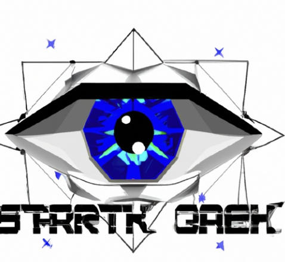

  <h1>StarkSight</h1>
  
   

## About

> Verify your World ID 👁️, ZK-Snark on Starknet ✨.

### What is StarkSight?

Sign in with [Worldcoin](https://docs.worldcoin.org/) and [Argent X](https://github.com/argentlabs/argent-x), and get World ID proof ( which is ZK-SNARK ) and verify it on Starknet using [Garaga](https://github.com/keep-starknet-strange/garaga). And get storage proof from Ethereum to Starknet using [Herodotus API](https://github.com/HerodotusDev/herodotus-eth-starknet). With StarkSight, you can use your World ID on Starknet.

### Usecase

As an example of how this can be used, the project has forked the Argent X wallet and added Worldcoin verification logic, allowing users to check their World ID verification directly on the wallet. So you can check your World ID verification on Argent X wallet directly.

---

🖥️ Contract & FrontEnd & StorageBridge: <https://github.com/HerodotusDev/starksight-zkhack>

🖥️ Argent-X-WorldCoin Extension: <https://github.com/HerodotusDev/argent-x-worldcoin>

<!-- 💡 Live Site: <https://fuchsia-app.vercel.app/> -->

---

## Architecture
