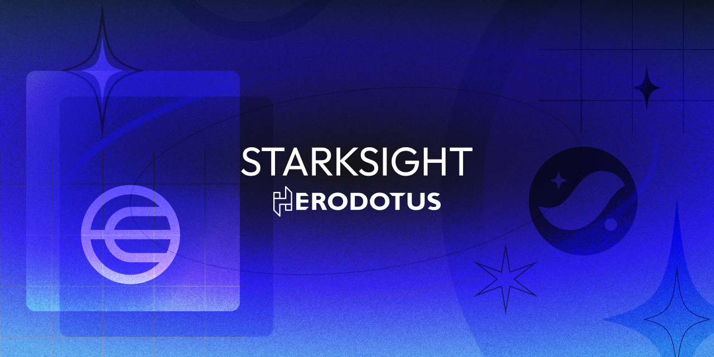

# StarkSight

## About

> Verify your World ID 👁️, on Starknet ✨.

### What is StarkSight?

Verify [World ID](https://worldcoin.org/world-id) proofs on Starknet using [Garaga](https://github.com/keep-starknet-strange/garaga) and [Herodotus](https://www.herodotus.dev).

### Lifecycle

1. User signs in with Argent and Worldcoin
2. Herodotus proves the WorldID merkle root on Starknet
3. User submits Starknet transaction, proving the generated WorldID SNARK

- Garaga is used to verify the Groth16 SNARK

4. Success :)

## Architecture

