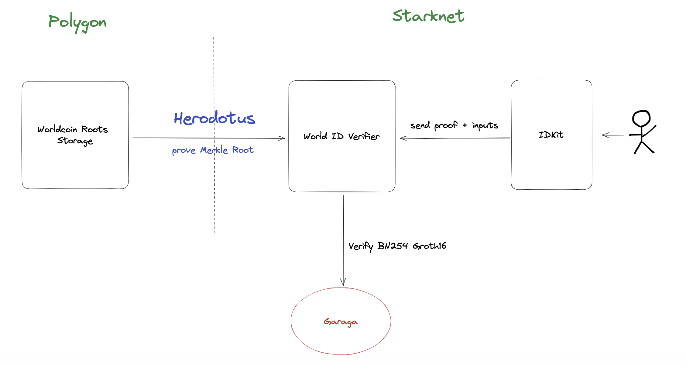

  <h1>StarkSight</h1>
  
   

## About

> Verify your World ID 👁️, ZK-Snark on Starknet ✨.

### What is StarkSight?

Verify World ID proofs on Starknet using [Garaga](https://github.com/keep-starknet-strange/garaga) and Herodotus

### Usecase

As an example of how this can be used, the project has forked the Argent X wallet and added World ID verification logic, allowing users to check their World ID verification directly on the wallet

---

🖥️ Argent-X-WorldID Extension: <https://github.com/HerodotusDev/argent-x-worldcoin>

---

## Architecture

